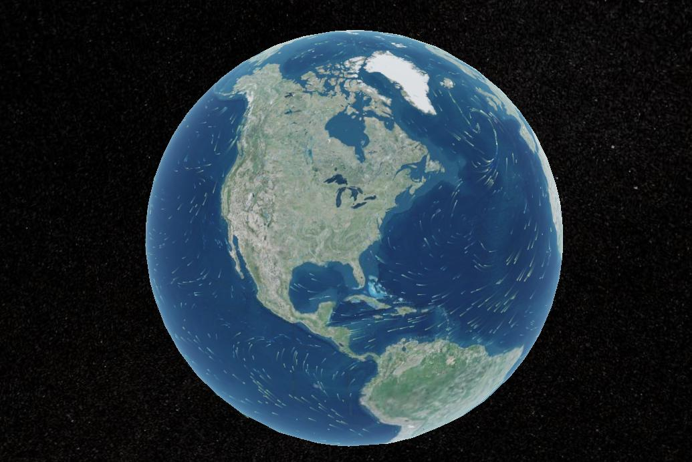

# 风场效果

## 两种使用方式

- 1. import WindLayer from 'chenkai-cesiumwind'
```javascript
import WindLayer from 'chenkai-cesiumwind';
```

- 2. import { Field, WindLayer } from ''chenkai-cesiumwind'
```javascript
import { Field, WindLayer } from 'chenkai-cesiumwind'
```

- 3.使用
**import 示例数据**
```javascript
import winddata from './assets/wind.js'
```
**加载风场图层**
```javascript
colorScale: [
      'rgb(33,33, 120)',
      'rgb(36,104, 180)',
      'rgb(60,157, 194)',
      'rgb(128,205,193 )',
      'rgb(151,218,168 )',
      'rgb(198,231,181)',
      'rgb(238,247,217)',
      'rgb(36,104, 180)',
      'rgb(60,157, 194)',
      'rgb(128,205,193 )',
      'rgb(151,218,168 )',
      'rgb(198,231,181)',
      'rgb(238,247,217)',
      'rgb(36,104, 180)',
      'rgb(60,157, 194)',
    ],
    frameRate: 16,
    maxAge: 60,
    globalAlpha: 0.9,
    velocityScale: 1 / 30,
    paths: 2000
  };
  // winddata在example目录下的示例数据
  const windLayer = new WindLayer(winddata, {windOptions});
  windLayer.addTo(viewer.value);
```
